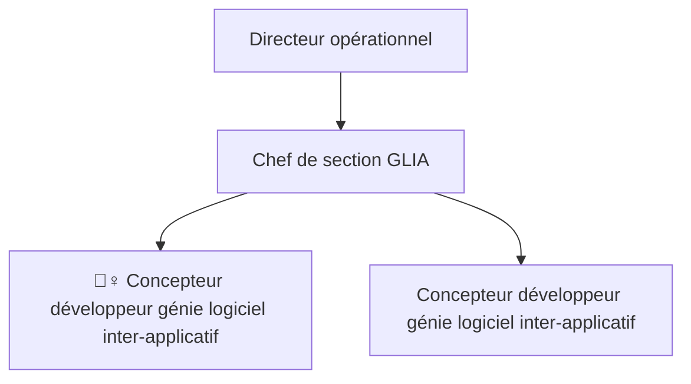

# ℹ️ Description générale

- **Description du poste :** Concepteur développeur Génie Logiciell Inter-Applicatif
- **Lieu d'exercice :** Direction Des Systèmes d’Snformation (DSI)
- **Lieu de travail :** [Immeuble Copernic – 59 rue Georges Clémenceau](https://maps.app.goo.gl/17yC1fXtiqgTyEFg7) - Nouméa
- **Référence :** [`3134-24-1105/SRdu12/07/`](https://bit.ly/3zQsk2n)
- **Employeur :** Office Des Postes et Télécommunications ([`OPT-NC`](https://x.com/OPT_NC))
- **Corps ou Cadre d’emploi/Domaine :** Ingénieur 1 eT/ou 2 ème grade dans le domaine informatique
- **Durée de résidence exigée en Nouvelle-Calédonie pour le recrutement sur titre :** au moins égale à 5 ans
- **Poste à pourvoir :** immédiatement
- **Date de dépôt de l’offre :** Vendredi 12 juillet 2024
- **Date limite de dépôt de candidature :** Vendredi 02 août 2024
- **Emploi `RESPNC` :** [concepteur développeur du SI](https://drhfpnc.gouv.nc/sites/default/files/atoms/files/12955314.PDF)

## 🎯 Missions

### 📑 Activités

Intégré au sein de la direction en charge des systèmes inter-applicatifs de l’OPT-NC,
le concepteur développeur participera aux travaux d’évolution et de maintenance
de ces systèmes.
Il permettra à la direction des systèmes d’information (DSI) de réaliser des solutions
développées à façon sur lestechnologies actuelles ou d’intégrer les besoins dans les
outils du SI (Springboot,Angular,Kafka,Spring Batch, TradeXpress, Apigee) afin de répondre de manière 
fiable et efficiente aux besoins.

### 🧑‍🤝‍🧑 Place dans l’organigramme 

- `N-3` parrapport au directeur opérationnel
- Fonction du supérieur hiérarchique directe : chef de section Génie Logiciel Inter-Applicatif (`GLIA`)

## 1️⃣ Activités principales

- Être garant de la qualité de ses travaux et de ses développements
- Appliquer les Frameworks de développement mis à disposition
- Concevoir, développer et tester ses réalisations
- Participer aux phases d’intégration des progiciels
- Participer à l’industrialisation des tests de non-régression ainsi qu’aux tests utilisateurs
- Rédiger les documentations techniques nécessaires
- Réceptionner et contrôler les livraisons logicielles fournies par les éditeurs
- Assurer un reporting régulier à l’équipe de développement
- Communiquer et se coordonner avec les acteurs concernés de la DSI
- Assurer le support de 3 ème niveau dans un cadre de maintenance

## 2️⃣ Activités secondaires

- Participer aux échanges techniques e tfonctionnels avec les éditeurs ou intégrateurs
- Assister l’exploitation dans l’analyse et la résolution des problèmes de production
- Être force de proposition pour tous les aspects techniques sur le domaine.

## 👨‍🏫 Profil du candidat

### 🎓 Savoir & Connaissance/Diplôme exigé:

- Expérience confirmée sur les frameworks J2EE : Hibernate,Spring,Springboot, Springbatch,...
- Connaissance des frameworks Front-End : Bootstrap, Angular2+
- Connaissance des outils Gitlab/Github, Sonarqube, Jenkins, Artifactory
- Connaissance approfondie des architectures logicielles (N-Tiers,SOA,WOA, microservices...)
- Connaissance d’approches Agiles ou Lean appréciées
- Connaissances des principaux systèmes d’exploitation, SGBD et langages Java, Javascript, PL/SQL...
- Gestion documentaire et deprojets : Confluence, JIRA, Sharepoint
- Anglais technique lu et écrit

### 🧰 Savoir-faire

- Mise en œuvre et déploiement d’interfaces selon des contraintes techniques
- Expérience Open Source appréciée
- Rédaction de documentations techniques, manuels, utilisateurs et supports de formation
- Communication efficace à l’oral et à l’écrit

### 🤝 Comportement professionnel

- Esprit d’équipe
- Culture de l’amélioration continue, de la qualité de service
- Implication et dynamisme
- Rigueur,sens de l’organisation et des méthodes
- Curiosité intellectuelle et goût pour les NTIC (nouvelles technologies de l'information et de la communication).

# 💬 Nous contacter

- [Adrien SALES](https://www.linkedin.com/in/adrien-sales/) : Chef de section Génie Logicie Iinter Applicatif (`GLIA`)
    - Tél. : `26.76.10`
    - Mél : `adrien.sales@opt.nc`

# 📝 Répondre à cette offre

Les candidatures (CV détaillé, lettre de motivation, photocopie des diplômes, fiche de renseignements, attestation sur
l’honneur de non bénéfice de la rupture conventionnelle, ainsi que la demande de changement de corps ou cadre d’emplois
si nécessaire (2)) précisant la référence de l’offre doivent parvenir à la direction des ressources humaines – service
développement des compétences – section recrutement compétences innovation formation initiale par :

- Voie postale : Direction générale – 2 rue Montchovet, Port Plaisance – 98841 Nouméa Cedex
- Dépôt physique : même adresse
- Mail : `mobilite.rh@opt.nc`
